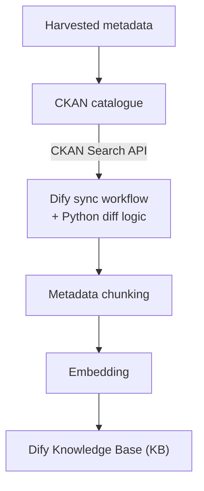
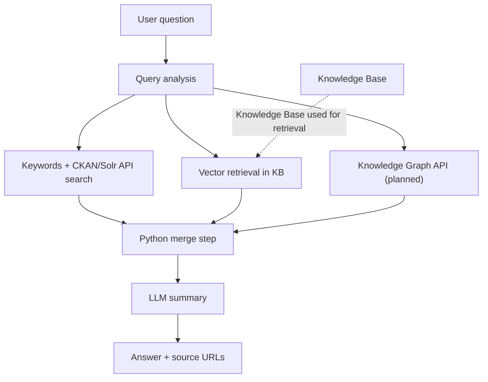

# RAG Architecture

## Overview

The AI Assistant uses a Retrieval-Augmented Generation (RAG) architecture. Instead of asking an LLM to answer only from
its internal knowledge, the system retrieves the information directly from the FEDORA data sources and then provides the
retrieved context to the LLM for synthesis.

The architecture is split into two pipelines.

### Scheduled sync pipeline

This pipeline prepares the CKAN content for semantic retrieval in the vector database.

### Conversational pipeline

This pipeline retrieves the relevant information for each user question and generates the final answer.

## Why multiple retrieval methods?

A single search technique can be not enough for every user question type.

### CKAN/Solr retrieval

CKAN's `package_search` API accepts Solr-style query parameters. This path is useful for explicit keywords, locations,
domain terms, tags, and other information represented directly in catalogue metadata.

For example, a question about *pedestrian mobility in City X* can be transformed into keywords and a catalogue query
that searches the relevant CKAN metadata.

### Vector retrieval

Semantic retrieval is useful when the wording of the user question is different from the wording used in the metadata.
CKAN metadata is embedded into vectors and stored in the Dify Knowledge Base. This allows semantically related metadata
to be retrieved even when there is no exact keyword match.

### Knowledge Graph retrieval

A Knowledge Graph developed by *Vicomtech* is planned as a third retrieval method. Its purpose is to add
relationship-aware results that can't be represented easily by keywords or vector search.

The graph integration is not currently in the pipeline. The API contract and the specific graph query logic will be
documented when the component is available.

## Result fusion and generation

Results from the available retrieval channels are deduplicated and merged in a Dify Python code node. This context is
then passed to an LLM.

The final LLM is responsible for:

- Answering the user's original question.
- Summarizing the retrieved datasets.
- Preserving useful catalogue and resource information.
- Returning the dataset/resource URLs if available.
- Avoiding claims not supported by the retrieved context.

## Components

| Component                       | Role                                                                 |
|---------------------------------|----------------------------------------------------------------------|
| CKAN catalogue                  | Source of truth for harvested dataset metadata and resources         |
| Solr CKAN API                   | Provides the catalogue search and access to metadata/resources       |
| Self-hosted Dify instance       | Orchestrates workflows, chatflows, code nodes, retrieval etc.        |
| Dify Knowledge Base             | Manages indexed metadata for semantic retrieval (vector database)    |
| OpenAI `text-embedding-3-small` | Generates embeddings for the indexed metadata                        |
| Python code nodes               | Implement a differential sync. and result fusion                     |
| Vicomtech Knowledge Graph       | Planned relationship-aware retrieval source                          |
| LLM                             | Generates a concise natural language response from retrieved context |
