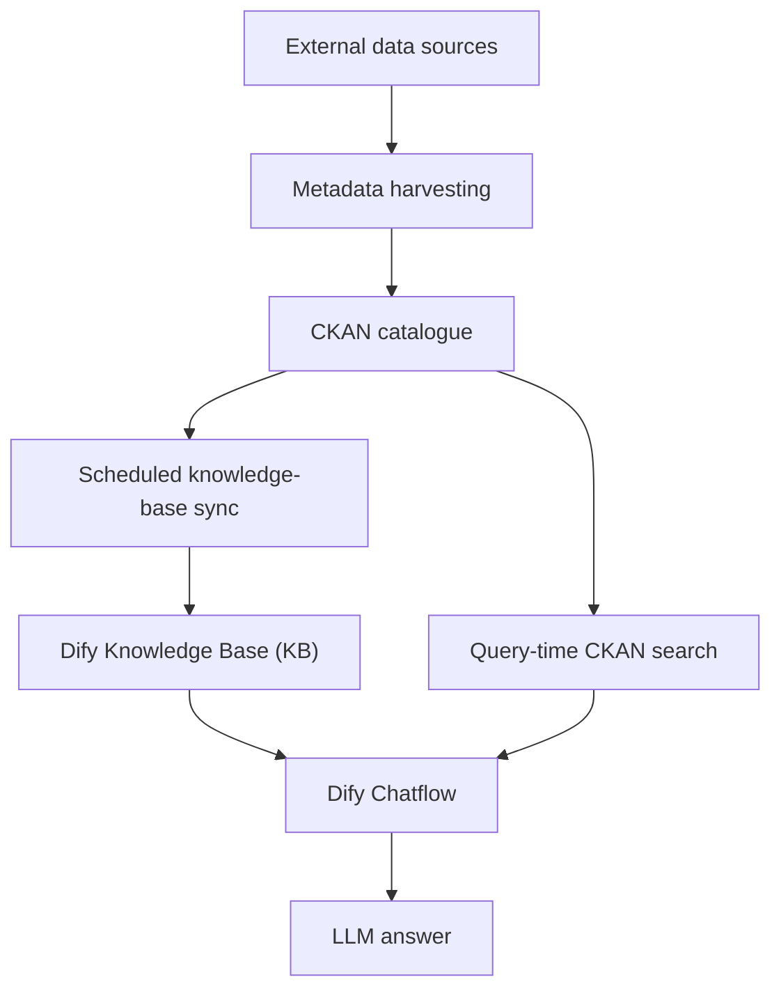

# AI Assistant Overview

## Introduction

The FEDORA AI Assistant is a natural-language interface for the data available in the FEDORA Data Space. It is designed
primarily to help users discover and understand datasets harvested into the CKAN catalogue.

It can be used for questions including:

- 'What are the columns of the dataset X?'
- 'Which datasets contain information about bicycle traffic?'
- 'Can you give me datasets about pedestrian mobility in Vienna?'
- 'Which available resources could help me study mobility patterns in a given city?'

The assistant is implemented using [Dify](https://github.com/langgenius/dify), an open-source platform for building AI
apps with workflows and chatflows. We use Dify to orchestrate different retrieval sources, processing steps, and large
language model (LLM) calls used by the assistant.

## Position in the FEDORA pipeline

The AI Assistant operates after the [metadata harvesting](../harvesting/introduction.md) stage.

The harvested CKAN catalogue is the source of truth for the dataset metadata. Currently, the RAG pipeline combines CKAN
keyword search with semantic search from the Dify Knowledge Base. A third retrieval source, based on the Knowledge Graph
developed by Vicomtech, is planned but not yet integrated.

## Main capabilities

### Dataset discovery

The AI assistant interprets a natural-language question and retrieves relevant datasets from the CKAN catalogue using
both lexical and semantic search strategies.

### Conversational search

For follow-up questions, the assistant can reformulate the current message using the conversation context before
retrieval. This makes queries such as 'and only the ones for Budapest?' usable even when the subject was mentioned in an
earlier turn.

### Dataset understanding

When a CKAN resource is available in the CKAN 'DataStore', the pipeline can retrieve a sample of the data in addition to
its metadata. This allows the assistant to answer questions about the dataset structure, such as column names,
representative values, and if some datasets could be compatible between them.

### Source-aware answers

Retrieved results are merged before generation so the final LLM can summarize the available information and add links
back to the datasets and resources.

## Retrieval sources

As mentioned above, the architecture combines three information sources:

1. **CKAN/Solr search** — keyword and structured catalogue retrieval using the CKAN API.
2. **Dify Knowledge Base** — semantic retrieval from vectorized CKAN metadata stored in Weaviate (vector database).
3. **Knowledge Graph** — a retrieval source developed by **Vicomtech**. This source is not integrated yet.

Together, this forms a hybrid RAG architecture: catalogue search provides precise keyword matching, vector retrieval
provides semantic similarity, and the future knowledge graph will provide relationship-aware retrieval.
