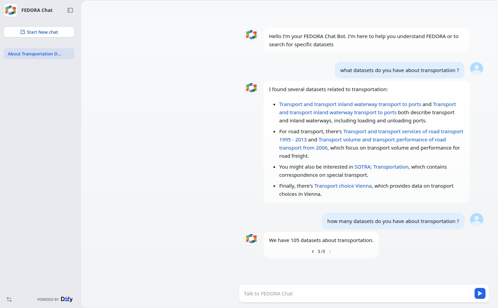

# User Guide

## What can I ask?

The AI Assistant is designed primarily for:

- Discovering and understanding the datasets available in the FEDORA CKAN catalogue.
- Asking questions about what is FEDORA, the objectives of the project, etc.

You can ask questions in natural language without knowing CKAN, Solr, or the structure of the catalogue.



## Dataset discovery

Ask for data about a subject, place, or mobility use case.

Examples:

- "Can you give me datasets about pedestrian mobility in Vienna?"
- "Find datasets related to bicycle traffic."
- "Are there datasets about public transport accessibility?"
- "Show me mobility datasets concerning Budapest."

The assistant combines catalogue search with semantic retrieval to find the top results and summarize them.

## Follow-up questions

The assistant is conversational, so a follow-up can refer to the previous question.

For example:

```text
<User>: Find datasets about active mobility in Austria.
<Assistant>: ...
<User>: Only the ones related to Vienna.
```

The chatflow can reinterpret the second message using the previous turns so that retrieval still contains the required
context.

## Questions about a specific dataset

If a dataset has already been identified, you can ask for more information about it.

Examples:

- 'What is this dataset about?'
- 'Who publishes it?'
- 'What resources are available?'
- 'Can you give me the URL?'

The answer is generated from the metadata retrieved from the FEDORA catalogue.

## Questions about columns and sample data

When a resource is available in the CKAN DataStore, the assistant may also have access to field information and a sample
of the data.

Examples:

- 'What are the columns of this dataset?'
- 'Does it contain coordinates?'
- 'Is there a timestamp column?'
- 'What kind of values does the `mode` field contain?'

Availability depends on the individual CKAN resource. Not every resource will have DataStore data available.

## How results are produced

For each question, the assistant uses multiple retrieval methods:

1. a CKAN/Solr catalogue search generated from the question.
2. semantic retrieval from the Dify Knowledge Base.
3. in the future, results from the Vicomtech Knowledge Graph.

The retrieved results are merged and supplied to an LLM, which summarizes them into a readable answer and includes
dataset/resource URLs when available.

## Interpreting answers

The AI Assistant is a discovery and interpretation layer over the catalogue. It should help you reach relevant source
datasets faster, but the CKAN catalogue and linked resources remain the authoritative sources.

When using an answer:

- follow the provided URL to inspect the original dataset.
- verify important metadata or values against the catalogue/resource.
- remember that a DataStore sample contains only a subset of records.
- do not interpret the sample-based answer as a complete statistical analysis.

## Current limitations

- The Vicomtech Knowledge Graph is planned but not yet integrated.
- Structured data inspection depends on CKAN DataStore availability.
- The quality of semantic retrieval depends on the metadata harvested into CKAN.
- Dataset updates reach the vector knowledge base after the scheduled synchronization workflow processes them.
- The assistant can summarize retrieved data, but it should not invent datasets or fields when retrieval provides no
  supporting evidence.
